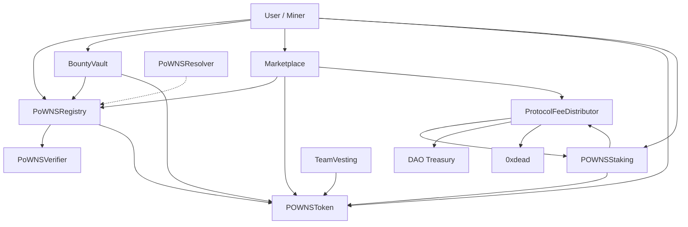
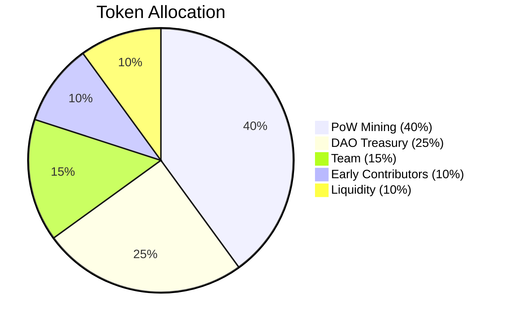

# PoWNS Contracts

Smart contracts for PoW Name Service - a decentralized naming system where domain scarcity is determined by computational work, not capital.

## Contracts

| Contract                 | Description                                                     |
| ------------------------ | --------------------------------------------------------------- |
| `PoWNSRegistry`          | Core registry - domain registration, renewal, release (ERC-721) |
| `PoWNSVerifier`          | SHA256 PoW verification with miner address binding              |
| `DifficultyManager`      | Dark Gravity Wave difficulty adjustment algorithm               |
| `PoWNSResolver`          | Address, text, and contenthash resolution                       |
| `BountyVault`            | Outsourced mining bounty market                                 |
| `POWNSToken`             | Native $POWNS ERC-20 token with mining rewards                  |
| `POWNSStaking`           | Stake tokens for revenue sharing and voting power               |
| `ProtocolFeeDistributor` | 50% stakers / 30% DAO / 20% burn                                |
| `Marketplace`            | Domain trading - fixed price, auction, offers                   |
| `DomainLeasing`          | Rent out resolver control                                       |
| `TeamVesting`            | 1-year cliff + 3-year linear vesting                            |

## Architecture



## Build

```bash
# Install dependencies
forge install

# Build
forge build

# Test
forge test

# Test with verbosity
forge test -vvv
```

## Deploy

```bash
# Set environment
export PRIVATE_KEY=your_private_key
export RPC_URL=your_rpc_url

# Deploy all contracts
forge script script/Deploy.s.sol:DeployPoWNS --rpc-url $RPC_URL --broadcast
```

## Token Economics



## License

MIT
